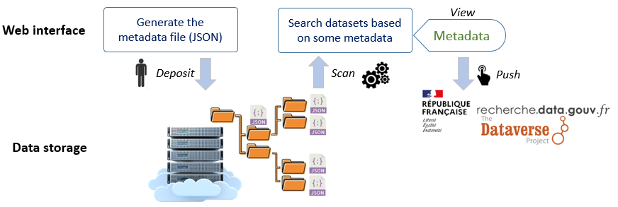

# Maggot

## Metadata Management Tool for Data Storage Spaces

**MAGGOT** is a metadata management tool that addresses the problems of organising, documenting, storing and sharing data in a research unit or infrastructure, and fits perfectly into a structural data management plan.

The web interface allows you to :

* **Describe** a dataset using metadata of different types by facilitating their entry and avoiding their re-entry thanks to personalized dictionaries (Description)
* **Search** datasets by their metadata (Accessibility)
* **Publish** the metadata of datasets along with their data files into the Recherche Data Gouv ([https://recherche.data.gouv.fr/en](https://recherche.data.gouv.fr/en)) repository (Publication)

This tool allows you to manage the metadata of any dataset. To do this:

* In a first step, you enter the metadata concerning the dataset using the web interface. For selection purposes, either a set of terms can be predefined, or terms can be added to the list and stored for future use.
* As output, you retrieve the generated JSON file, then drop it into the corresponding data directory.
* In order for this metadata file to be taken into account, you either launch a scan manually, or wait for the next automatic scan to be triggered (via cron).
* Finally, you can search for your datasets using a dedicated web interface to find them by specifying one or more criteria.

An overview is given by the figure below:

<figure><figcaption></figcaption></figure>
