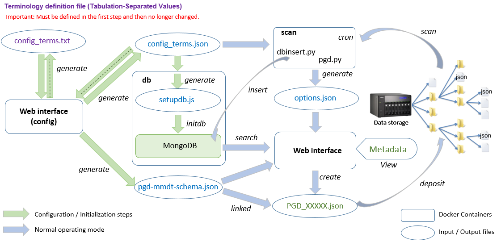
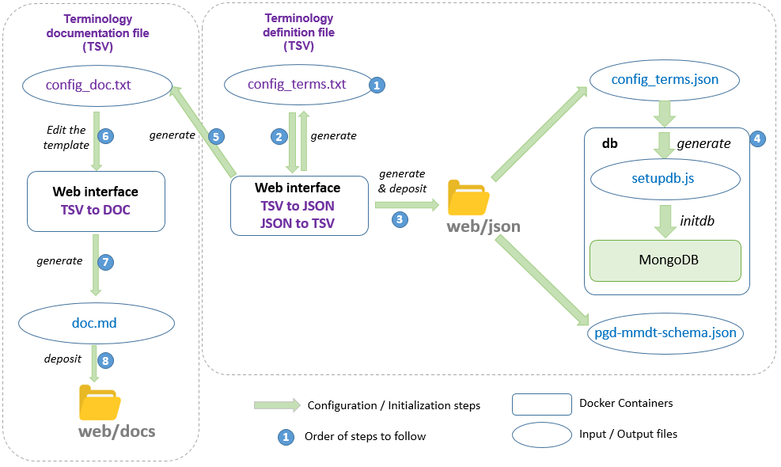
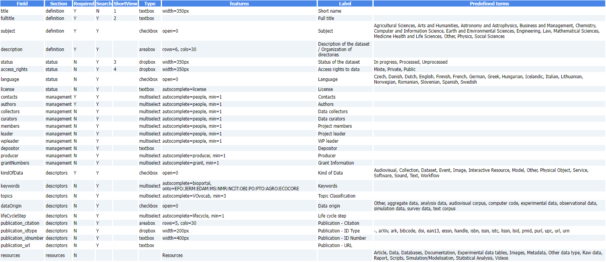
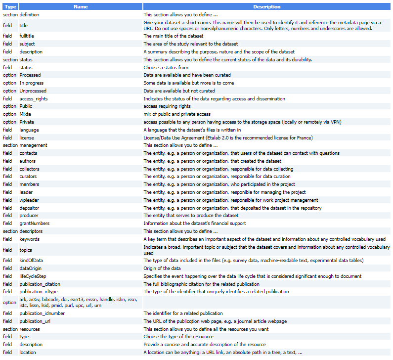

# Configuration

<figure><figcaption>
Architecture diagram
</figcaption></figure>

<figure><figcaption>
Configuration workflow
</figcaption></figure>

<figure><figcaption></figcaption></figure>

<figure><figcaption>
Documentation of the terminogy
</figcaption></figure>
